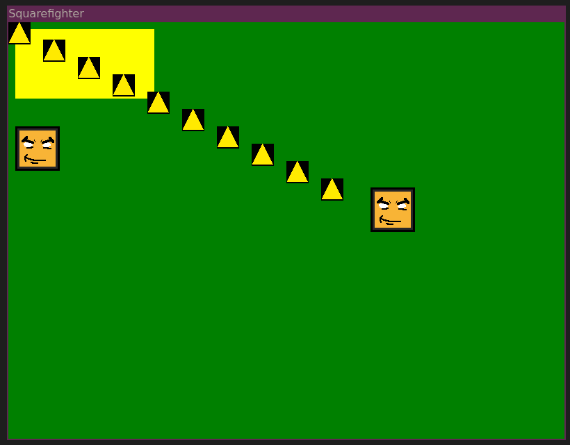
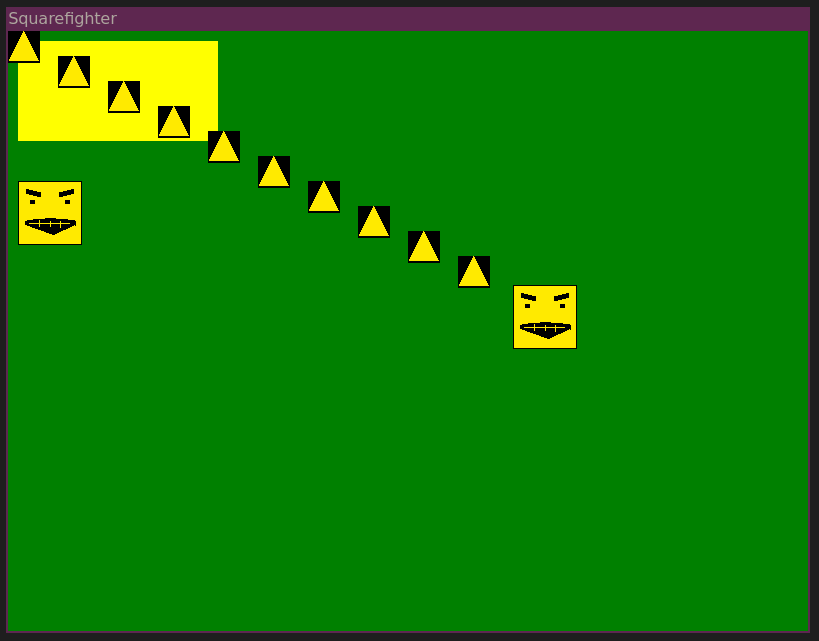
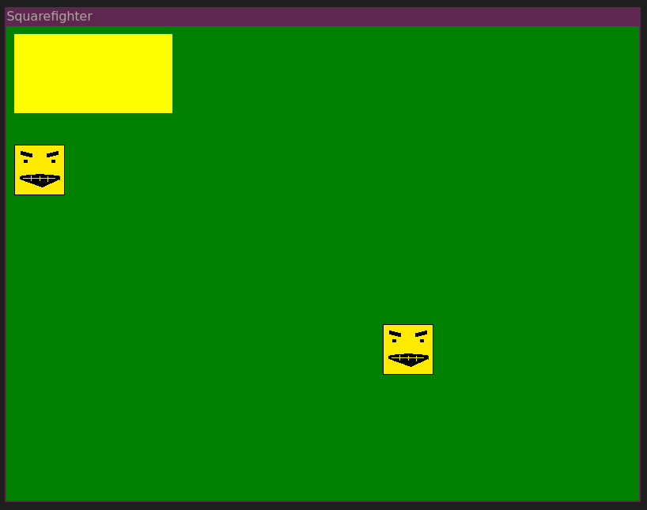
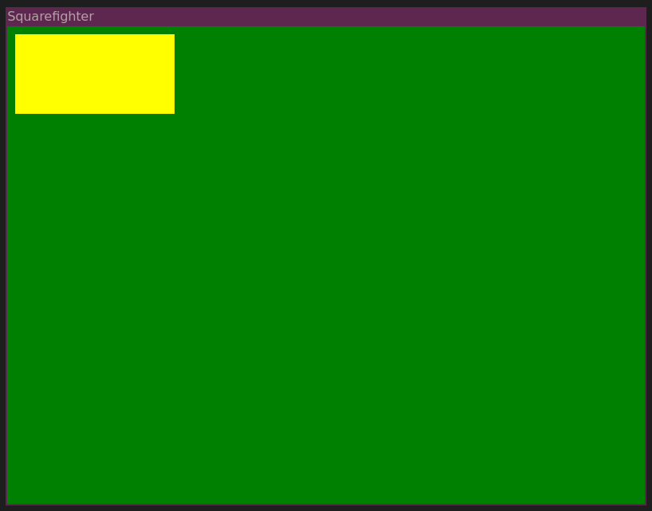

# Squarefighter - initial implementation in C

fighting squares with nothing but squares, say no to fancy models!

# Motivation:
- Getting re-aquainted with libSDL2
- ~~using chipmunk-physics for physics :P~~
- using [ferox](https://github.com/c-krit/ferox) for physics ;)

# Amazing Screenshots:
03 - static bullets mato player

02 - static bullets

01 - sprite loading works:  

00 - A yellow rect (oh no it's not a square - aaaa):  

